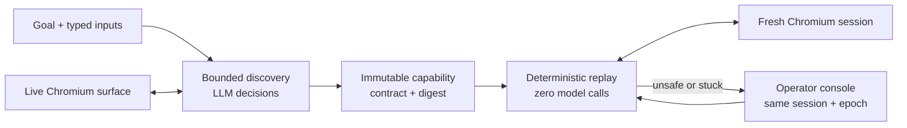

# Handrail

[](https://github.com/codelit-io/handrail-cua/actions/workflows/ci.yml)

Handrail is a compact computer-use automation runtime that discovers a workflow once, compiles the verified interaction into a reviewable capability artifact, and replays that artifact deterministically without a model.

The included vertical slice operates an explicitly synthetic legacy member-services UI. It demonstrates real browser interaction, bounded LLM-driven discovery, typed artifact compilation, zero-model replay, and exclusive same-session human handoff. It is a take-home system design and implementation, not a deployed banking service.

Start with the [system design specification](docs/SYSTEM_DESIGN_SPEC.md) for requirements, trust boundaries, authority types, state machines, decisions, and SDD-to-code verification. The shorter [requirements trace](docs/REQUIREMENTS.md) maps every assignment requirement to implementation, tests, and release evidence.



## What is real, and what is intentionally synthetic

| Area | Status | Meaning |
| --- | --- | --- |
| Browser actions | Implemented | Playwright drives a real Chromium page, including a hostile iframe boundary. |
| Live discovery | Evidence-gated | A qualifying manifest v1.2 bundle records native Ollama `qwen3:4b` making schema-constrained decisions from fresh semantic surface observations and compiling the checked-in capability. `npm run evidence:validate` is the authoritative gate. |
| Offline discovery | Deterministic fixture | `ScriptedPlanner` exercises the complete discovery/compiler path without a model or network service. It is for repeatability and development, not evidence of genuine LLM discovery. |
| Capability replay | Implemented | Replay validates the artifact, binding, input contract, policy, targets, outputs, and terminal checkpoint with no planner import or model call. |
| Human handoff | Implemented | A loopback, capability-gated operator console revokes automation, controls the existing surface session under an epoch lease, audits redacted actions, and resumes only after a fresh observation. |
| Target data | Synthetic | Member records, failure scenarios, branding, and all screenshots are local fixtures. No real customer data or credentials are used. |
| Production control plane | Deliberate cut | Durable queues, databases, distributed leases, remote operator authentication, and native desktop adapters are described as evolution seams, not represented as shipped features. |

`modelCalls` counts planner decisions, so an offline discovery summary can have a non-zero count. Qualifying live evidence additionally binds provider `ollama-local`, transport `native-ollama`, `liveModel: true`, and the selected model's 64-character Ollama digest. OpenAI-compatible transport cannot claim a reserved native provider identity.

## Checked-in release evidence

The sanitized [evidence bundle](evidence/README.md) is accepted for release only under manifest v1.2. `npm run evidence:validate` accepts that bundle only when it proves:

- genuine local Ollama discovery with `transport: native-ollama`, a model digest, `liveModel: true`, one or more model calls, semantic-only model input, and source/bundled-target/runtime provenance bound to a committed source revision;
- one immutable typed capability plus a current strict approval record bound to its ID, revision, and canonical digest;
- at least 10 matching fresh-session success replays, an internally consistent stability report, and zero model calls in every replay;
- `MEMBER_NOT_FOUND` preserved as an expected business outcome rather than a generic failure; and
- one manifest-bound handoff replay proving the approved artifact identity, same surface-session ID, monotonic ownership epochs, durable authorization/completion audit events, fresh passing resume checkpoint, and exact screenshot references.

Exact model-call count, artifact/model digests, run IDs, replay count, and latency are read from the validated manifest, summaries, and stability report rather than duplicated in prose. Discovery and normal replay use different browser session IDs; the handoff run must retain one identical session ID before and after operator control. Raw model prompts, provider transcripts, browser storage, cookies, credentials, and base64 screenshots are not retained.

## Quick start: deterministic and offline

Requirements:

- Node.js 22.18 or newer
- npm
- Chromium installed through Playwright

CI pins Node.js 22.18.0 as the minimum supported baseline. Evidence records the generator's Node version for provenance, but validation remains portable across supported Node versions.

Use a normal full-history Git clone for release validation. The evidence manifest is intentionally bound to its historical source revision, so a depth-limited checkout must run `git fetch --unshallow --tags` before `npm run verify`.

```bash
npm ci
npx playwright install chromium
npm run demo:offline
```

`demo:offline` runs locally with the scripted planner. It is the fastest way to exercise the synthetic target, discovery/compiler pipeline, artifact validation, and fresh-session replay without Ollama, an API key, or an external service.

Run the complete verification suite with:

```bash
npm run verify
```

## Genuine Ollama discovery, then replay

The default live planner uses Ollama's native `/api/chat` endpoint. The model receives a bounded, redacted semantic observation and classification/availability metadata for invocation contracts. Raw classified input and output values are not included. Runtime screenshots remain available for evidence and operator review but are not sent as model vision input in this demo.

In terminal A, start Ollama (leave this process running):

```bash
ollama serve
```

In terminal B, pull the default semantic model:

```bash
ollama pull qwen3:4b
```

Then run the discovery agent. It emits a draft artifact for review:

```bash
HANDRAIL_OLLAMA_BASE_URL=http://127.0.0.1:11434 \
HANDRAIL_MODEL=qwen3:4b \
npm run discover -- \
  --planner live \
  --goal "Look up the member by member number and return the current balance for the Savings account." \
  --member-id 84721 \
  --run-id assignment-discovery \
  --output work/assignment-discovery

# After reviewing the exact JSON, issue an immutable approval bound to its
# artifact ID, revision, and digest.
npm run approve -- \
  --artifact work/assignment-discovery/artifact.json \
  --reviewer evaluator-01 \
  --confirm-reviewed \
  --output work/assignment-approval

npm run replay -- \
  --artifact work/assignment-discovery/artifact.json \
  --artifact-approval work/assignment-approval/artifact-approval.json \
  --member-id 26017 \
  --run-id assignment-replay \
  --output work/assignment-replay
```

The repository never auto-approves qualifying live evidence. `npm run approve` validates the exact artifact and requires explicit review confirmation before it writes an immutable digest-bound record. The live evaluator command persists its discovered artifact, announces `awaiting_approval`, and waits for a separately issued approval before any replay begins. A pre-existing approval path is rejected, so discovery and approval cannot collapse into one self-authoring step.

The evaluator path generates a new live evidence bundle, one exceptional replay, and a ten-run deterministic stability report in an ignored work directory:

```bash
HANDRAIL_OLLAMA_BASE_URL=http://127.0.0.1:11434 \
HANDRAIL_MODEL=qwen3:4b \
npm run demo:live -- \
  --run-id assignment-live \
  --replays 10 \
  --artifact-approval work/assignment-live-approval/artifact-approval.json \
  --source-revision "$(git rev-parse HEAD)" \
  --output work/assignment-live-evidence
```

When the command prints `awaiting_approval`, inspect `work/assignment-live-evidence/artifacts/member.balance.lookup.v1.json` in a separate terminal and issue the approval:

```bash
npm run approve -- \
  --artifact work/assignment-live-evidence/artifacts/member.balance.lookup.v1.json \
  --reviewer independent-reviewer \
  --confirm-reviewed \
  --output work/assignment-live-approval
```

The waiting command validates that record against the exact artifact and its creation time, then continues. It also resolves the native Ollama model digest before and after discovery and fails if the selected identity or digest changes mid-run.

Revision-bound evidence requires that `--source-revision` equal the checked-out commit and that `src/` contain no uncommitted changes. Evidence writes are immutable, so this command never replaces the checked-in release bundle.

Both discovery commands accept an explicit `--goal` and `--target http://host/legacy`. When `--target` is omitted, Handrail starts the synthetic target itself. This vertical slice accepts goal and target input inside the typed member-balance capability contract; arbitrary capability contracts are intentionally outside the take-home scope.

A genuine discovery record must identify provider `ollama-local`, transport `native-ollama`, the actual model and digest, `liveModel: true`, and one or more model calls. The subsequent replay must report `modelCalls: 0`. See [docs/DEMO.md](docs/DEMO.md) for the evidence boundary and presentation flow.

## Configuration

| Variable | Default | Purpose |
| --- | --- | --- |
| `HANDRAIL_OLLAMA_BASE_URL` | `http://127.0.0.1:11434` | Canonical native Ollama endpoint used only by live discovery. `OLLAMA_HOST` is also accepted. |
| `HANDRAIL_MODEL` | `qwen3:4b` | Canonical Ollama model used for live discovery. `OLLAMA_MODEL` is also accepted. |
| `HANDRAIL_PLANNER_PROVIDER` | `ollama` | Select native `ollama` or an explicitly configured `openai-compatible` endpoint. Transport provenance remains distinct from caller-provided provider labels. |
| `LLM_BASE_URL` | none | Required HTTPS-or-loopback base URL when `HANDRAIL_PLANNER_PROVIDER=openai-compatible`. |
| `LLM_MODEL` | none | Required model identifier for the OpenAI-compatible planner. |
| `LLM_API_KEY` | `local-only` | Optional bearer credential for an explicitly configured OpenAI-compatible endpoint; never retained in evidence. |
| `HANDRAIL_PROVIDER_NAME` | `openai-compatible-local` | Non-reserved provenance label for an OpenAI-compatible transport. |
| `HANDRAIL_ALLOW_REMOTE_MODEL_EGRESS` | `false` | Explicitly authorize semantic data egress to an HTTPS non-loopback Ollama or OpenAI-compatible endpoint. Remote cleartext HTTP is always rejected, and this opt-in does not enable screenshot input. |
| `HANDRAIL_INCLUDE_SCREENSHOT` | `false` | Opt in to screenshot model input only for a configured vision-capable model; `--include-screenshot` is the CLI equivalent. |
| `HANDRAIL_MODEL_TIMEOUT_MS` | `45000` | Bound each model request from 1,000 to 600,000 milliseconds. |
| `HANDRAIL_HEADLESS` | `true` | Set to `false` to watch Chromium during a local demo. |
| `HANDRAIL_EVIDENCE_DIR` | Run-specific local default | Root for sanitized artifacts, JSONL events, summaries, and screenshots. |

No model configuration is needed for replay or `demo:offline`; [.env.example](.env.example) contains both planner shapes. `--include-screenshot` is optional and should be used only with a configured vision-capable model; the default `qwen3:4b` run uses semantic observations. The manifest records the effective CLI-or-environment screenshot setting. Persistent JSON evidence keeps structural audit fields, not raw page text or planner rationale. Never commit credentials, raw browser storage, provider transcripts, or unsanitized evidence. `--screenshots-safe` may assert pixel safety for an external target, but it cannot label that target as the bundled fixture or qualify it for committed assignment evidence.

## Runtime outcomes

Every invocation returns one of four typed states:

- `succeeded`: outputs validate and the compound terminal checkpoint passes.
- `business_outcome`: an expected domain result such as `MEMBER_NOT_FOUND` occurred.
- `needs_intervention`: the current browser session is retained for a human because continuing automatically would be unsafe or unproductive.
- `failed`: preflight, compatibility, policy, target, application, or checkpoint validation failed with a structured fault.

Known transient states have small, explicit retry budgets. Ambiguous targets, stale model decisions, policy escapes, unknown states, and non-idempotent retry requests fail closed.

Model discovery is semantic-only: it can activate a current enumerated element reference but is never offered a raw coordinate action. Artifact string patterns are fully anchored, fixed-width, and input-bounded; variable regex operators and regex text predicates are rejected before a browser session can start.

Tenant target overrides are replay-only compatibility records. Each replacement must be review-bound to the digests of both the artifact target and override target; discovery forbids all overrides so it compiles the surface it actually observes.

## Same-session operator control

When a run requests help, Handrail opens a loopback-only console for the existing `SurfaceSession`. Each intervention has a cryptographically random bearer capability in the URL fragment. The bootstrap exchanges it for a path-scoped, `HttpOnly`, `SameSite=Strict` cookie and clears the fragment before loading runtime state. The capability remains reusable for the intervention lifetime, so the link and the bootstrapped browser session must stay private. Every state, screenshot, and mutation route rejects a missing or mismatched capability.

The operator claims the current epoch, can click the live screenshot, type into the focused control, press an allowlisted key, and capture evidence. Every operator action is serialized, checks a fresh URL, passes the same fail-closed policy intersection, persists an authorization-intent event, and is URL-checked again at dispatch. Automation's prior grant is invalid immediately. A stale claim or competing owner receives `CONTROL_LOST`.

Returning control performs a fresh observation, evaluates the checkpoint, and issues a new automation grant. Evaluator entrypoints persist redacted completion events and captured images into the run; a configured audit or capture sink failure fails the lease and blocks resume. A standalone embedding that omits these sinks has in-memory audit only. The console never launches, replaces, closes, or silently recreates the target browser session.

Run the evaluator handoff path in a headed browser:

```bash
npm run replay -- \
  --artifact evidence/artifacts/member.balance.lookup.v1.json \
  --artifact-approval evidence/artifacts/member.balance.lookup.v1.approval.json \
  --member-id 84721 \
  --scenario session-expired \
  --handoff \
  --headed \
  --run-id evaluator-handoff \
  --output work/evaluator-handoff
```

Open the printed `intervention` URL, claim control, capture the expired state, select **Restore Session** in the live screenshot, capture the restored state, then choose **Return to automation**. The summary records the original/resumed session ID, authority epochs, checkpoint result, operator-event count, screenshot hashes, and zero-model completion. For release evidence, attach that run to the live bundle and validate manifest v1.2 as shown in [the demo guide](docs/DEMO.md); the validator, rather than this prose, proves the complete sequence and artifact binding.

## Screenshots

These sanitized local screenshots form the scenario review matrix. They are visual QA aids, not a substitute for the machine-validated manifest v1.2 bundle.

| Scenario | Screenshot | Scenario | Screenshot |
| --- | --- | --- | --- |
| Legacy surface | [desktop target](docs/screenshots/legacy-surface-desktop.png) | Different-input replay | [successful replay](docs/screenshots/replay-success-different-input.png) |
| Expected outcome | [member not found](docs/screenshots/replay-member-not-found.png) | Permission fault | [permission denied](docs/screenshots/replay-permission-denied.png) |
| Ambiguity fault | [ambiguous target](docs/screenshots/replay-ambiguous-target.png) | Handoff desktop | [retained session](docs/screenshots/operator-handoff-desktop.png) |
| Handoff mobile | [responsive console](docs/screenshots/operator-handoff-mobile.png) | Recovery | [restored session](docs/screenshots/operator-session-restored.png) |

## Repository guide

| Path | Responsibility |
| --- | --- |
| `src/model/` | Structured live and scripted discovery planners. |
| `src/surface/` | Browser-independent surface contract and Playwright adapter. |
| `src/runtime/` | Discovery, compilation, replay, policy, redaction, evidence, and control leases. |
| `src/operator/` | Same-session operator HTTP console and responsive UI. |
| `src/target/` | Local synthetic legacy application and deterministic fault states. |
| `test/` | Unit, integration, real-browser, failure-injection, and handoff tests. |
| `docs/` | Canonical SDD, requirements traceability, demo script, UI spec, and QA plan. |
| `evidence/` | Sanitized run evidence when produced and release-validated. |

The concise engineering rationale is in [REPORT.md](REPORT.md). Verification status and stop-ship gates are in [docs/QA.md](docs/QA.md), with the pre-remediation findings and verified closure record in [docs/SECURITY_REVIEW.md](docs/SECURITY_REVIEW.md).
