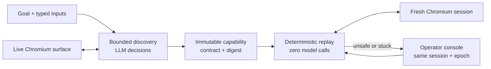
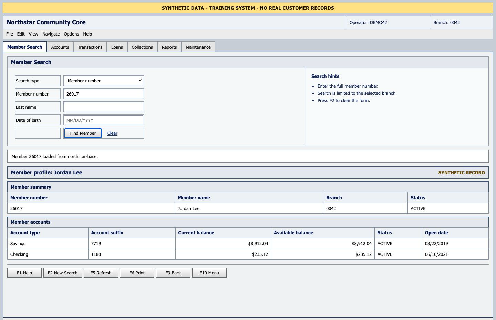
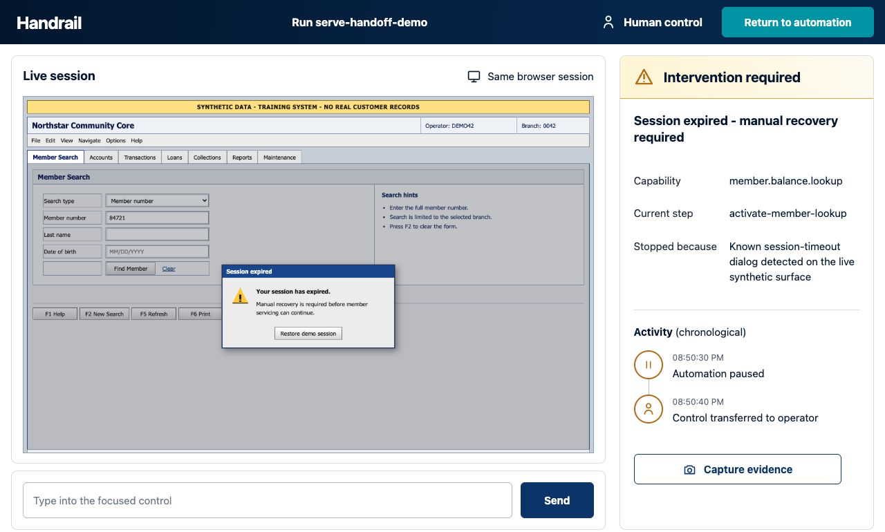

# Handrail

[](https://github.com/codelit-io/handrail-cua/actions/workflows/ci.yml)

Handrail is a compact computer-use automation runtime that discovers a workflow once, compiles the verified interaction into a reviewable capability artifact, and replays that artifact deterministically without a model.

The included vertical slice operates an explicitly synthetic legacy member-services UI. It demonstrates real browser interaction, bounded LLM-driven discovery, typed artifact compilation, zero-model replay, and exclusive same-session human handoff. It is a take-home system design and implementation, not a deployed banking service.



## What is real, and what is intentionally synthetic

| Area | Status | Meaning |
| --- | --- | --- |
| Browser actions | Implemented | Playwright drives a real Chromium page, including a hostile iframe boundary. |
| Live discovery | Verified | Native Ollama `qwen3:4b` made four schema-constrained decisions from fresh semantic surface observations and compiled the checked-in capability. The manifest records `liveModel: true`. |
| Offline discovery | Deterministic fixture | `ScriptedPlanner` exercises the complete discovery/compiler path without a model or network service. It is for repeatability and development, not evidence of genuine LLM discovery. |
| Capability replay | Implemented | Replay validates the artifact, binding, input contract, policy, targets, outputs, and terminal checkpoint with no planner import or model call. |
| Human handoff | Implemented | A loopback operator console revokes automation, controls the existing surface session under an epoch lease, audits redacted actions, and resumes only after a fresh observation. |
| Target data | Synthetic | Member records, failure scenarios, branding, and all screenshots are local fixtures. No real customer data or credentials are used. |
| Production control plane | Deliberate cut | Durable queues, databases, distributed leases, remote operator authentication, and native desktop adapters are described as evolution seams, not represented as shipped features. |

`modelCalls` counts planner decisions, so an offline discovery summary can have a non-zero count. Provider identity and `liveModel` are the authoritative distinction: `handrail-fixture` plus `false` is scripted; `ollama-local` plus `true` is genuine live discovery.

## Checked-in release evidence

The sanitized [evidence bundle](evidence/README.md) is independently validated by `npm run evidence:validate` and records:

- genuine local Ollama discovery with `qwen3:4b`, `liveModel: true`, and four model calls;
- one immutable, typed capability with canonical digest `d06ba78e8be50f9ff23bf0a5bb51ae5c05a043c9cb66bf85b4ac0c38bbc3da64`;
- 10 of 10 fresh-session replays succeeding with zero total model calls;
- 1,967.4 ms mean replay latency and 2,028 ms p95 on the evidence machine; and
- `MEMBER_NOT_FOUND` preserved as an expected business outcome, not a generic failure.

The discovery and replay runs use different browser session IDs. Raw model prompts, provider transcripts, browser storage, cookies, credentials, and base64 screenshots are not retained.

## Quick start: deterministic and offline

Requirements:

- Node.js 22.18 or newer
- npm
- Chromium installed through Playwright

```bash
npm ci
npx playwright install chromium
npm run demo:offline
```

`demo:offline` runs locally with the scripted planner. It is the fastest way to exercise the synthetic target, discovery/compiler pipeline, artifact validation, and fresh-session replay without Ollama, an API key, or an external service.

Run the complete verification suite with:

```bash
npm run verify
```

## Genuine Ollama discovery, then replay

The default live planner uses Ollama's native `/api/chat` endpoint. The model receives a bounded semantic observation from the current live surface; runtime screenshots remain available for evidence and operator review but are not sent as model vision input in this demo.

Start Ollama and make the default semantic model available:

```bash
ollama serve
ollama pull qwen3:4b
```

Then run the discovery agent and replay the exact artifact it emitted:

```bash
HANDRAIL_OLLAMA_BASE_URL=http://127.0.0.1:11434 \
HANDRAIL_MODEL=qwen3:4b \
npm run discover -- \
  --planner live \
  --goal "Look up the member by member number and return the current balance for the Savings account." \
  --run-id assignment-discovery \
  --output work/assignment-discovery

npm run replay -- \
  --artifact work/assignment-discovery/artifact.json \
  --run-id assignment-replay \
  --output work/assignment-replay
```

The evaluator path generates a new live evidence bundle, one exceptional replay, and a ten-run deterministic stability report in an ignored work directory:

```bash
HANDRAIL_OLLAMA_BASE_URL=http://127.0.0.1:11434 \
HANDRAIL_MODEL=qwen3:4b \
npm run demo:live -- \
  --run-id assignment-live \
  --replays 10 \
  --output work/assignment-live-evidence
```

Evidence writes are immutable, so this command never replaces the checked-in release bundle.

Both discovery commands accept an explicit `--goal` and `--target http://host/legacy`. When `--target` is omitted, Handrail starts the synthetic target itself. This vertical slice accepts goal and target input inside the typed member-balance capability contract; arbitrary capability contracts are intentionally outside the take-home scope.

A genuine discovery record must identify provider `ollama-local`, the actual model, `liveModel: true`, and one or more model calls. The subsequent replay must report `modelCalls: 0`. See [docs/DEMO.md](docs/DEMO.md) for the evidence boundary and presentation flow.

## Configuration

| Variable | Default | Purpose |
| --- | --- | --- |
| `HANDRAIL_OLLAMA_BASE_URL` | `http://127.0.0.1:11434` | Canonical native Ollama endpoint used only by live discovery. `OLLAMA_HOST` is also accepted. |
| `HANDRAIL_MODEL` | `qwen3:4b` | Canonical Ollama model used for live discovery. `OLLAMA_MODEL` is also accepted. |
| `HANDRAIL_PLANNER_PROVIDER` | `ollama` | Select `ollama` or an explicitly configured `openai-compatible` endpoint. |
| `HANDRAIL_HEADLESS` | `true` | Set to `false` to watch Chromium during a local demo. |
| `HANDRAIL_EVIDENCE_DIR` | Run-specific local default | Root for sanitized artifacts, JSONL events, summaries, and screenshots. |

No model configuration is needed for replay or `demo:offline`. `--include-screenshot` is optional and should be used only with a configured vision-capable model; the default `qwen3:4b` run uses semantic observations. Persistent JSON evidence keeps structural audit fields, not raw page text or planner rationale. Never commit credentials, raw browser storage, provider transcripts, or unsanitized evidence. Use `--screenshots-safe` with an external target only after its adapter has independently verified pixel masking.

## Runtime outcomes

Every invocation returns one of four typed states:

- `succeeded`: outputs validate and the compound terminal checkpoint passes.
- `business_outcome`: an expected domain result such as `MEMBER_NOT_FOUND` occurred.
- `needs_intervention`: the current browser session is retained for a human because continuing automatically would be unsafe or unproductive.
- `failed`: preflight, compatibility, policy, target, application, or checkpoint validation failed with a structured fault.

Known transient states have small, explicit retry budgets. Ambiguous targets, stale model decisions, policy escapes, unknown states, and non-idempotent retry requests fail closed.

## Same-session operator control

When a run requests help, Handrail opens a loopback-only console for the existing `SurfaceSession`. The operator claims the current epoch, can click the live screenshot, type into the focused control, press an allowlisted key, and capture evidence. Automation's prior grant is invalid immediately. A stale claim or competing owner receives `CONTROL_LOST`.

Returning control performs a fresh observation, evaluates the checkpoint, and issues a new automation grant. The console never launches, replaces, closes, or silently recreates the target browser session.

## Screenshots

These sanitized local screenshots show deterministic real-browser replay and the expired-session operator flow. They are visual QA evidence, not a substitute for the native Ollama discovery manifest.

| Fresh-session replay with a different typed input | Human control of the retained expired session |
| --- | --- |
|  |  |

## Repository guide

| Path | Responsibility |
| --- | --- |
| `src/model/` | Structured live and scripted discovery planners. |
| `src/surface/` | Browser-independent surface contract and Playwright adapter. |
| `src/runtime/` | Discovery, compilation, replay, policy, redaction, evidence, and control leases. |
| `src/operator/` | Same-session operator HTTP console and responsive UI. |
| `src/target/` | Local synthetic legacy application and deterministic fault states. |
| `test/` | Unit, integration, real-browser, failure-injection, and handoff tests. |
| `docs/` | Frozen design, requirements traceability, demo script, and QA plan. |
| `evidence/` | Sanitized run evidence when produced and release-validated. |

The concise engineering rationale is in [REPORT.md](REPORT.md). Verification status and stop-ship gates are in [docs/QA.md](docs/QA.md).
