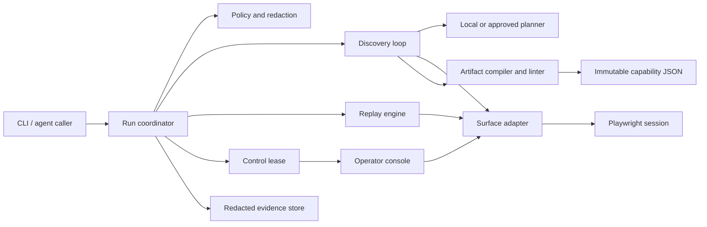
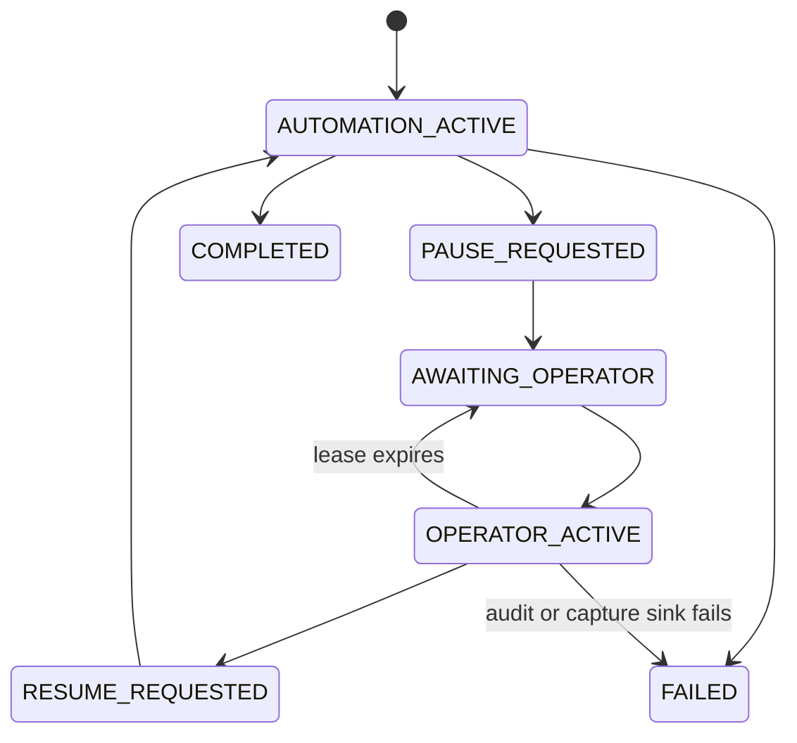

# Handrail architecture specification

Status: implementation-aligned overview; the canonical normative design is [SYSTEM_DESIGN_SPEC.md](SYSTEM_DESIGN_SPEC.md)

## Decision summary

Handrail is a modular TypeScript monolith. One process owns the Playwright browser context, discovery loop, deterministic replay engine, policy and redaction gates, evidence writer, control lease, and a tiny operator HTTP surface. This is the smallest architecture that makes same-session handoff real. It also avoids fabricating distributed durability the assignment does not require.

Discovery is the only model-backed path. By default it gives the model the goal, a bounded redacted semantic observation, contract availability/classification metadata, allowed actions, and current observation references. Raw classified input/output values stay local. Screenshot input is an independent opt-in for a configured vision-capable model and is not part of the default `qwen3:4b` flow. Replay consumes an immutable declarative capability and contains no model dependency.



## Runtime boundaries

```ts
interface SurfaceAdapter {
  createSession(binding: AppBinding): Promise<SurfaceSession>;
  observe(session: SurfaceSession, options: ObserveOptions): Promise<Observation>;
  resolve(session: SurfaceSession, target: TargetSpec): Promise<ResolvedTarget>;
  dispatch(
    session: SurfaceSession,
    command: SurfaceCommand,
    grant: ControlGrant,
    signal: AbortSignal,
  ): Promise<ActionReceipt>;
  evaluate(session: SurfaceSession, predicate: Predicate): Promise<PredicateResult>;
  extract(session: SurfaceSession, extractor: ExtractorSpec): Promise<unknown>;
  captureEvidence(session: SurfaceSession, policy: EvidencePolicy): Promise<EvidenceRef>;
}

interface DiscoveryModel {
  decide(input: {
    goal: string;
    observation: RedactedSemanticObservation;
    contracts: ContractAvailabilityAndClassification;
    allowedCommands: CommandKind[];
  }): Promise<ModelDecision>;
}
```

Core modules never import Playwright Page or Locator. BrowserSurface owns frames, runtime screenshots, live element references, hit testing, and locator resolution. A future desktop adapter can implement the same observe, resolve, dispatch, evaluate, and extract vocabulary with OS accessibility and OCR.

## Discovery protocol

1. Validate the request, input definitions, target binding, and hard policy.
2. Create a browser session and acquire the automation control lease.
3. Observe the live surface. The observation contains a resized screenshot, route-only URL, surface fingerprint, and ephemeral element references with roles, visible text, contextual table labels, frame paths, and normalized bounds.
4. Send the goal, contract availability/classification metadata, allowed actions, and the redacted semantic observation to the planner. Raw classified invocation values stay local. An optional screenshot is sent only under a separate vision opt-in. The planner returns one structured action: set a value, activate a current element reference, wait, extract, finish, or request help.
5. Reject stale observation IDs, invented references, every model coordinate action, disallowed actions, and unsafe effects before dispatch. Geometry remains observation metadata and a separately authorized human-console input, never model authority.
6. Execute one bounded action, record its receipt, and verify its post-state from a fresh observation.
7. Compile only successful, postcondition-verified actions against current semantic element references. The artifact retains durable semantic, contextual, frame, or visual anchors, never element handles or raw coordinates.
8. Finish only after the declared output and global checkpoint validate. Lint, digest, and save the artifact as draft.

Persistent audit events retain decision kinds, current observation and element references, structural observation metadata, and action receipts. They deliberately omit page text, planner rationales, free-form intervention state, hidden chain-of-thought, and raw provider transcripts.

## Capability artifact

The artifact is declarative intermediate representation rather than executable code:

```ts
interface CapabilityArtifact {
  schemaVersion: "1.0.0";
  id: string;
  revision: number;
  name: string;
  description: string;
  digest: string;
  compatibility: {
    product: { vendor: string; product: string; versionRange?: string };
    requiredSurfaceCapabilities: SurfaceCapability[];
    fingerprint: FingerprintRule;
  };
  entrypoint: { bindingKey: string; route?: PathTemplate };
  contract: {
    inputs: Record<string, InputSpec>;
    outputs: Record<string, OutputSpec>;
    outcomes: KnownOutcomeSpec[];
  };
  targets: Record<string, TargetSpec>;
  policyRequirements: CapabilityPolicyRequirements;
  steps: Step[];
  success: Predicate;
  provenance: {
    discoveryRunId: string;
    modelId: string;
    promptHash: string; // ordered trace of this run's exact serialized planner requests
    createdAt: string;
  };
}
```

Per-invocation values are expression nodes such as source input and name memberId, never handlebars strings or copied literals. Targets live in a dictionary so a tenant binding may specialize a logical control without rewriting the workflow. Approval metadata is stored separately by canonical artifact digest; approving a capability never mutates the reviewed content.

The linter rejects sensitive literals, raw scripts, policy-escaping routes, targets without durable candidates, broad or ambiguous selectors, steps without postconditions, automatic retry on non-idempotent actions, outputs without validators, and artifacts without a terminal checkpoint.

## Locator lattice

Each TargetSpec contains a deterministic priority order and an exactly-one-visible match contract:

1. Accessible role plus exact normalized name.
2. Associated label text.
3. Contextual table relationship, such as control in the row labeled Member number.
4. Anchored relationship, such as the Available balance cell in the row whose Account type is Savings.
5. Stable non-sensitive attribute with recorded justification.
6. Visual anchor constrained to a normalized region, only when policy permits.

Every candidate is checked against a semantic fingerprint and a stable interval. Zero matches tries the next candidate. Multiple matches never use first; they fail closed as TARGET_AMBIGUOUS. Frame paths are explicit and re-resolved after navigation. Element handles and absolute coordinates are not persisted in an approved artifact.

## Replay and outcomes

Replay validates artifact, digest, approval state, binding fingerprint, input schema, and policy before opening or mutating the target. The same effective origin/route intersection is projected into browser request and frame enforcement, including explicitly declared asset/frame subpaths. Replay re-resolves targets immediately before each action, uses bounded condition waits instead of blind sleeps, runs only artifact-declared recovery, validates typed outputs, and verifies a compound terminal checkpoint.

```ts
type RunResult<Output> =
  | { status: "succeeded"; outputs: Output; checkpointEvidence: EvidenceRef[]; meta: RunMeta }
  | { status: "business_outcome"; outcome: KnownOutcome; evidence: EvidenceRef[]; meta: RunMeta }
  | { status: "needs_intervention"; intervention: InterventionView; meta: RunMeta }
  | { status: "failed"; error: AutomationFault; meta: RunMeta };
```

Known business outcomes such as MEMBER_NOT_FOUND are returned to the caller and are not crashes. A known notice or transient load may be dismissed or retried within a small artifact-declared budget. Session expiry, unknown dialogs, and exhausted declared recovery request intervention. Target ambiguity fails closed as `TARGET_AMBIGUOUS`; an attempted risky action without exact authority fails `POLICY_DENIED`. Permission denial, invalid artifacts, and incompatible surfaces are also debuggable terminal faults.

No non-idempotent or commit action is retried automatically. Global sentinels for app errors, permission denial, session expiry, and unexpected dialogs are evaluated before a generic postcondition failure.

## Safety model

Three layers are intersected, never merged permissively: platform hard policy, tenant/app binding policy, and capability requirements. Exact origins, route patterns, allowed command kinds, and effect classes are enforced before every discovery, replay, and operator action and after redirects or popups. Each session is single-page: popup targets and `window.open` are rejected, unexpected pages are closed, and any attempt fails the session. The effective origin/route intersection is also enforced for every page, frame, redirect, post-action observation, and subresource request; service workers, WebSockets, WebRTC, WebTransport, and non-proxied UDP are blocked because they are outside this HTTP surface contract.

Page content is untrusted input. A model can reference only a current observation ID and enumerated element refs. Arbitrary JavaScript, shell commands, downloads, clipboard access, file upload, credentials, cookies, headers, storage state, and unknown action types are denied.

Artifact string patterns use a deliberately small, fully anchored fixed-width language: concatenated ASCII literals or character classes with optional fixed counts and an explicit maximum input length. Groups, alternation, variable quantifiers, lookarounds, backreferences, wildcards, and regex text predicates are rejected during compilation. This keeps contract matching bounded without placing native JavaScript regex complexity on the replay event loop.

Values carry public, internal, PII, or secret classification. Secrets come from a runtime broker or preauthenticated session and are never exposed to the model. Goal, route, role, input-type, context, and visible semantic labels pass the shared secret/PII/Luhn redactor before model serialization. Structured logging redacts by data lineage and defensive patterns, and persistent events minimize arbitrary surface/model text. Screenshot writes require an explicit assertion that pixel redaction has already been verified; this demo may assert it because every displayed record is a conspicuous synthetic fixture. A production adapter must mask declared sensitive regions before making that assertion. The local model endpoint is loopback by default; non-loopback semantic egress requires explicit approval and HTTPS, while screenshot input requires its own opt-in. Each planner hashes the exact serialized request bytes it sends, and discovery combines only that run's ordered per-call hashes into artifact provenance.

## Same-session control transfer

Every command passes through one action mutex and an epoch-based lease:



Automation quiesces at an action boundary, records its last receipt, and atomically increments the lease epoch. A random bearer capability gates the intervention routes; it is exchanged from the URL fragment into a scoped cookie, remains reusable for that intervention, and is separate from the operator's short-lived epoch claim. The operator uses the console to click coordinates, type into the focused control, press keys, or capture evidence on the same Playwright Page. Generic click, type, and key actions are `commit`; only capture is `read`. An admitted action drains and returns its receipt before an elapsed TTL moves the coordinator back to awaiting operator, avoiding a mutate-then-report-failure ambiguity. Evaluator entrypoints persist redacted authorization intent before dispatch and completion after success; a configured audit/capture sink failure fails the lease and blocks resume. The embeddable server has only in-memory audit if a caller omits those sinks. Bounded polling recovers one-off observation failures without issuing new authority. Resume atomically releases human ownership; automation reacquires only after a fresh observation and either advances when the human satisfied the current postcondition or safely retries the current idempotent step.

A stale epoch, token, or duplicate claimant is rejected as CONTROL_LOST. Lease expiry returns to awaiting operator; it never silently gives automation control. Local process death loses the live session and is reported honestly as SESSION_LOST.

## Heterogeneity and tenant reuse

A canonical artifact is scoped to a vendor, product, and compatible version family. It contains no tenant base URL, branding, credentials, or browser state. AppBinding supplies the tenant instance, exact origin, entrypoints, secret references, expected fingerprint, policy, and optional digest-reviewed replay-only target overrides. Discovery forbids overrides so it compiles targets from the current surface.

A preflight fingerprint scores stable product signals such as frame names, route shapes, normalized headings, and version markers. Below threshold, replay returns INCOMPATIBLE_SURFACE before any write. A replay override may replace a logical target only when its review record binds the base and replacement target digests; it cannot change step semantics or policy. Semantic workflow differences require a new artifact revision and approval. Replay health by digest plus fingerprint provides the future drift signal.

The production evolution is straightforward but intentionally unbuilt here: tenant-isolated browser workers, durable compare-and-swap lease storage, immutable artifact catalog, encrypted short-TTL evidence storage, and a scheduler around deterministic replay.

## Cost and scale posture

- One model call per bounded discovery step; semantic observations are compacted, and screenshots are resized only when the independent vision opt-in is enabled.
- Prompt hash and concise decisions retained; raw transcript and base64 image data discarded.
- Zero model calls during normal capability invocation.
- Single process, JSON artifacts, JSONL events, and local static assets for the take-home.
- No premature queue, cluster, database, or multi-tenant administration surface.
- Optional stretch work is limited to a typed capability catalog and a repeated-replay stability score after the core passes.
