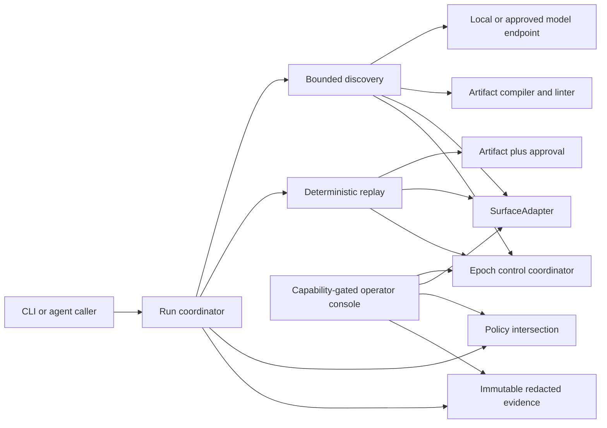
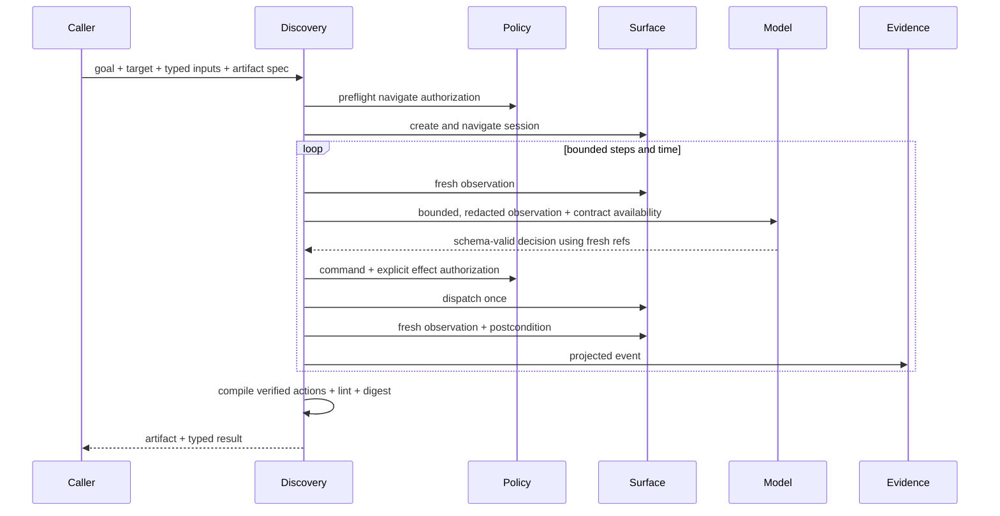
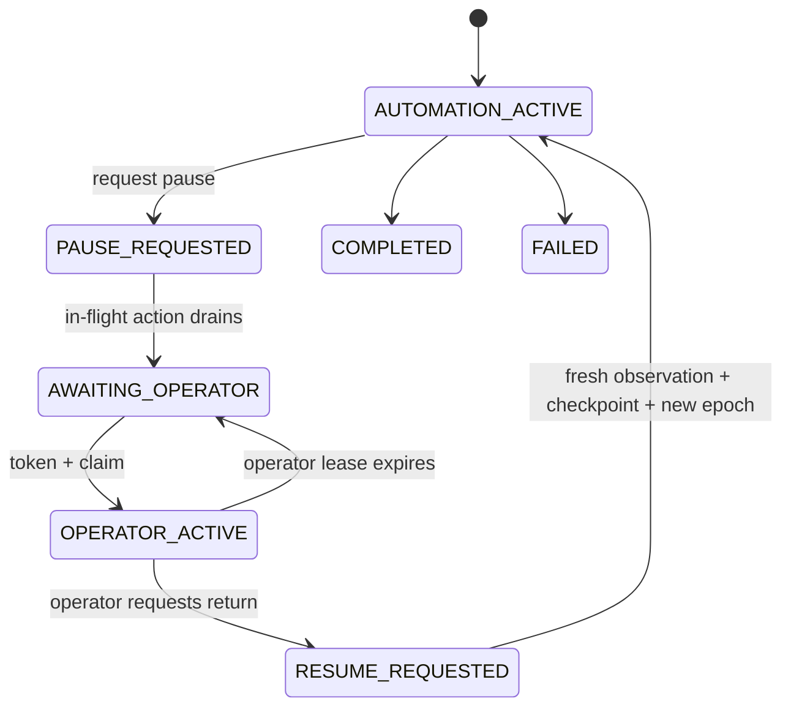

# Handrail system design specification

Document status: audited submission baseline, revision 1.2

Source: Interface.ai Computer-Use Automation System take-home, Sections 1-11; Section 10 is glossary context

Implementation: `codelit-io/handrail-cua`
Last reviewed: 2026-08-28

This is the canonical engineering specification for the submitted vertical slice. `REPORT.md` is the required short-form rationale; this document records the requirements, assumptions, contracts, state transitions, security boundaries, implementation trace, and acceptance gates used to build and review the system.

## 1. Problem and objectives

Handrail gives an agent a safe execution path for a legacy application that has no API:

1. accept a natural-language goal, target entry point, and typed invocation inputs;
2. let a real model discover a successful interaction on a live surface;
3. compile only verified actions into a typed, versioned capability artifact;
4. replay the artifact in a fresh session without a model in the decision loop;
5. classify business outcomes, bounded recovery, intervention, and hard failure explicitly;
6. cede the exact live session to a human and resume under a new ownership epoch; and
7. retain useful, privacy-safe, hash-inventoried evidence bound to immutable source and release commits.

The primary quality attributes are safety, determinism, reviewability, debuggability, and honest scope. Throughput and distributed scale are design constraints, not features built for the take-home.

### 1.1 Non-goals

- No real bank, customer record, credential, or regulated production data.
- No attempt to bypass an available API.
- No distributed queue, browser fleet, durable cross-process lease, or remote operator service.
- No native desktop adapter claimed as implemented.
- No open-ended model recovery during production replay.
- No arbitrary JavaScript, shell, download, clipboard, upload, or filesystem action vocabulary.

## 2. Requirements baseline

The assignment's must-have sections map to the following system requirements.

| ID | Source | Requirement | Acceptance condition |
| --- | --- | --- | --- |
| R-3.1-A | 3.1 | Accept goal and target | CLI accepts bounded `--goal` and exact-origin `--target` inputs. |
| R-3.1-B | 3.1 | Real LLM observe-decide-act loop | A non-fixture model chooses schema-valid actions against fresh observations of a real Chromium surface. |
| R-3.1-C | 3.1 | Bounded stop conditions | Step, time, recovery, stale-observation, invalid-decision, and dead-end bounds terminate safely. |
| R-3.2-A | 3.2 | Typed, serializable capability | Artifact declares version, purpose, inputs, outputs, outcomes, targets, steps, effects, policy, checkpoint, and provenance. |
| R-3.2-B | 3.2 | Robust control identification | Targets use ordered semantic/contextual candidates, exactly-one matching, fingerprints, and rationale. |
| R-3.2-C | 3.2 | Reviewable immutability | Canonical content digest and a trusted approval bind public/evaluator replay to the reviewed artifact content; only explicitly selected lower-level test/discovery composition may run non-strict. |
| R-3.3-A | 3.3 | Zero-model deterministic replay | Replay imports no planner and reports `modelCalls: 0`. |
| R-3.3-B | 3.3 | Inputs, outputs, and checkpoint | Inputs bind before session creation; outputs validate; each step and the terminal state have predicates. |
| R-3.3-C | 3.3 | Explicit runtime taxonomy | Return exactly one of success, business outcome, intervention, or debuggable failure. |
| R-3.3-D | 3.3 | Deliberate exception handling | Known transient states are bounded; not-found is a business outcome; denial, ambiguity, timeout, and app faults stop. |
| R-3.4-A | 3.4 | Configurable allowlist | Exact origin, route, command, and effect must pass every policy layer immediately before action. |
| R-3.4-B | 3.4 | Conservative effect handling | Every discovered activation is preclassified; unknown activation defaults to commit and is denied; commit requires exact authority and is not retried. |
| R-3.4-C | 3.4 | Sensitive-data controls | Values are classified; artifacts use references; logs are projected and redacted; screenshot persistence requires pixel-safety attestation. |
| R-3.5-A | 3.5 | Structured run evidence | Every persisted JSONL event uses one correlated, ordered audit envelope. |
| R-3.5-B | 3.5 | Rich failure/intervention signal | Synthetic runs retain screenshots and structured diagnostic categories without arbitrary page text. |
| R-3.6-A | 3.6 | Detect and route | Discovery and replay can create an intervention with goal/capability, reason, state, step, evidence, session, and epoch. |
| R-3.6-B | 3.6 | Same-session control | Operator actions address the already-created `SurfaceSession`; no replacement session is permitted. |
| R-3.6-C | 3.6 | Exclusive resume | Pause, quiesce, claim, act, resume, and return issue monotonically newer leases and require a fresh passing checkpoint. |
| R-3.6-D | 3.6 | Human-action evidence | Operator actions are policy-authorized, redacted, and written into the run's durable audit log. |
| R-3.7-A | 3.7 | Surface abstraction | Core flow depends on `SurfaceAdapter`, not Playwright types or selectors. |
| R-3.7-B | 3.7 | Tenant reuse and drift | Product-family artifact is separated from tenant binding; fingerprints gate compatibility; replay-only target overrides require review binding and discovery rejects them. |
| R-6-A | 6 | Exact deliverables | Root `README.md`, seven-heading `REPORT.md`, public source, and `/evidence/` are present. |
| R-6-B | 6 | End-to-end evidence | Bundle contains genuine live discovery, deterministic replay, exception handling, and a demonstrable handoff path. |

## 3. Assumptions and trust boundaries

### 3.1 Explicit assumptions

1. The included application and every displayed record are synthetic. The pixel-safety assertion is valid only for this target.
2. A vendor product's UI changes slowly enough for reviewed targets to be reusable, but runtime business and session states vary.
3. The Playwright process, local artifact catalog, policy configuration, and local Ollama process are inside the submitted prototype's trusted host boundary.
4. A non-loopback model endpoint is outside that boundary. It is rejected unless a caller explicitly records data-governance approval; screenshots remain independently opt-in.
5. Tenant bindings are control-plane configuration, not model output. A target replacement is replay-only and requires a digest-bound review record; discovery rejects bindings with replacements so it compiles what it actually observes.
6. An in-memory browser session cannot survive process loss. Handrail reports session loss rather than creating a substitute and pretending continuity.
7. Loopback is not authentication. The operator console therefore uses a random per-intervention capability token in addition to loopback binding and an opaque, short-lived ownership claim.
8. Artifact approval and action approval are different: artifact approval authorizes immutable capability content; a bound action approval authorizes one risky operation and is consumed once within one replay invocation; a human control grant authorizes an operator for one session epoch.

### 3.2 Data classes

| Class | Example | Artifact | Model request | Persistent evidence |
| --- | --- | --- | --- | --- |
| Public | synthetic control label | Allowed when needed | Allowed | Allowed after pattern redaction |
| Internal | synthetic balance | Output schema/reference only | Availability metadata; value stays local unless remote egress is explicitly approved | Redacted or omitted |
| PII | member number | Typed input reference only | Availability metadata; known values masked from observations | Redacted |
| Secret | token, password, cookie | Secret reference only | Never sent as an invocation value | Never persisted |

## 4. Architecture

Handrail is a modular monolith so one process can own the browser context and make handoff continuity testable.



### 4.1 Component responsibilities

| Component | Owns | Must not own |
| --- | --- | --- |
| Planner | One bounded decision from current refs | Browser handles, persistent transcript, replay execution |
| Discovery engine | Loop bounds, freshness, effect policy, action verification, compilation | Arbitrary action execution or artifact approval |
| Artifact compiler | Schema, lint, canonical digest, expression binding | Live UI state or credentials |
| Replay engine | Preflight, target resolution, deterministic steps, outcomes, checkpoints | Planner/model dependency |
| SurfaceAdapter | Session, perception, target resolution, dispatch, extraction, screenshot | Workflow policy or business taxonomy |
| Policy | Intersection of platform, binding, and capability constraints | Unioning permissions or inferring intent from UI text |
| Control coordinator | Exclusive owner, epoch, lease, action serialization | Operator UI or surface creation |
| Operator console | Same-session manual controls and resume bridge | New target session, policy bypass, durable secret storage |
| Evidence writer | Projection, redaction, ordered envelope, immutable files | Raw transcript, cookies, storage state, unverified pixels |

## 5. Core contracts

### 5.1 Capability artifact

The artifact is declarative intermediate representation, not a recording of raw clicks and not generated executable code. It contains:

- `schemaVersion`, logical ID, revision, purpose, and canonical digest;
- product compatibility, required surface capabilities, and fingerprint threshold;
- typed input/output/outcome contract with data classifications;
- logical target dictionary with an ordered locator lattice and review rationale;
- ordered steps with effect, idempotency, timeout, retry policy, and postcondition;
- terminal success predicate and policy requirements; and
- discovery provider/model provenance plus a domain-separated ordered SHA-256 trace of the exact serialized planner request bodies used by that run.

Invocation values use expression nodes such as `{kind: "input", name: "memberId"}`. Raw per-run values and model transcripts are not artifact fields.

### 5.2 App binding and tenant override

`AppBinding` supplies exact origin, named entrypoints, expected product fingerprint, secret-broker references, tenant policy, and optional logical-target replacements. Overrides are a replay-only compatibility mechanism: discovery rejects any binding that contains one so the model observes and compiles the current surface. An override cannot change a step, command, effect, input, output, or outcome. Replacing an artifact target during replay requires a review record binding the SHA-256 of both the base and replacement target; unreviewed or mismatched replacements fail preflight before session creation.

### 5.3 Result contract

```text
succeeded         -> validated outputs + checkpoint evidence
business_outcome  -> declared outcome code + evidence
needs_intervention-> contextual intervention + retained session
failed            -> phase/code/step + safe diagnostic categories + evidence
```

The branches are mutually exclusive. `MEMBER_NOT_FOUND` is a valid caller-visible outcome, not an internal crash.

### 5.4 Persisted audit event

Every line in `events.redacted.jsonl` has the same required envelope:

```text
schemaVersion, eventId, sequence, timestamp, runId, correlationId,
sessionId?, artifactId?, actor, ownerEpoch, type, ...projected fields
```

The writer owns contiguous sequence assignment. The validator checks unique event IDs, run identity, expected start and terminal events, model-decision counts, and zero-model replay. Free-form page text, planner rationale, typed values, and raw receipt messages are excluded. Fixed `reasonCode`, fault code, phase, step, effect, and safe expected/observed categories retain the useful "what and why."

## 6. Execution design

### 6.1 Discovery sequence



Discovery preflight rejects target overrides. An activation is offered to the model only when at least one visible control has an explicit discovery activation policy. The selected control is classified again immediately before dispatch. An undeclared activation defaults to `commit`; without exact authority it is blocked. Only idempotent, non-commit activations receive automatic retry.

Each planner hashes the exact UTF-8 JSON string it sends, including fixed instructions, dynamic semantic projection, structured-output schema, model/options, and any opt-in screenshot. The response carries that call's request hash; discovery assembles only its own ordered hashes into `provenance.promptHash`. This remains correct when one planner instance serves interleaved runs and does not persist raw prompts or responses.

### 6.2 Replay sequence

1. Parse artifact, recompute digest, and validate the required artifact approval, binding, reviewed overrides, typed inputs, and policy. The exported engine defaults to strict; lower-level discovery/test composition must explicitly select non-strict.
2. Deny invalid preflight before creating a surface.
3. Create a fresh session, project every policy layer's origin/route bounds into browser request and frame interception, navigate within that effective boundary, and verify product fingerprints. Capability routes must include required same-origin frame and asset subpaths; the demo uses `/legacy` plus `/legacy/**`.
4. For each step: resolve exactly one target, authorize the exact command/effect/operation, dispatch, inspect global sentinels, and verify the step postcondition.
5. Validate outputs and the compound terminal predicate.
6. Return a typed result with `modelCalls: 0` and close or deliberately retain the session.

### 6.3 Handoff state machine



The old automation grant must be invalid before operator action. The assigned operator first presents a random bearer capability from the URL fragment; the browser exchanges it for a path-scoped `HttpOnly`, `SameSite=Strict` cookie and clears the fragment. That capability is reusable for the intervention lifetime, so it must remain private and is not a substitute for operator identity. The operator then holds a separate short-lived claim bound to the current owner epoch.

Each click, type, key, and capture is serialized, observes the current URL, passes the operator policy hook, and records an authorization-intent audit event before reaching `SurfaceAdapter`; the adapter rechecks the expected URL at dispatch. Generic click, type, and key operations are conservatively `commit` because focus/blur handlers can persist data; capture alone is `read`. An action admitted under a valid lease drains and returns its receipt even if the TTL expires during the operation, after which the coordinator transitions to awaiting operator. It never mutates and then retroactively reports that the action did not happen. A completion event follows a successful action. The evaluator CLI supplies durable audit and capture sinks. If a configured sink fails before dispatch, the claim is stopped without acting; if completion persistence fails after a side effect, the lease is failed and resume is blocked because the physical action cannot be rolled back. The embeddable server retains only in-memory audit when no sink is supplied, so production callers must require durable sinks. Resume must return the same session ID, a newer automation epoch, a fresh observation ID, and a passing recovery checkpoint. Bounded state polling retries transient observation failure without granting new authority; repeated failure closes the intervention.

## 7. Safety design

### 7.1 Policy intersection

Effective permission is the intersection of three independently evaluated layers:

```text
platform maximum
  AND tenant binding origin/route/command/effect
  AND capability requirements
  AND exact approval when an effect requires it
```

An omitted dimension means a layer does not constrain it; an empty allowlist denies all. Origin comparison is exact, route patterns are bounded, redirects are rechecked, and action approval never widens a layer.

The browser adapter enforces one page per session and the same effective origin/route policy across the page, every frame, request, redirect, and post-action observation. It rejects popup targets, disables `window.open`, closes any asynchronously created page, blocks WebSocket/service-worker/WebRTC/WebTransport escape paths, and fails the session on route drift. Automated discovery can activate only a current semantic element reference; raw model coordinates are never offered or accepted. Separately, operator coordinate and focused-key actions receive fresh URL, lease, policy, and post-dispatch checks and are conservatively classified as commit.

Artifact-controlled native regular expressions are not an execution primitive. String validators use a fully anchored fixed-width subset made only of ASCII literals or character classes with optional fixed counts and a mandatory bounded `maxLength`. Groups, alternation, variable quantifiers, lookarounds, backreferences, wildcards, and regex text predicates fail artifact lint before replay.

### 7.2 Authority types

| Authority | Bound to | Purpose | Reuse |
| --- | --- | --- | --- |
| Artifact approval | artifact ID + revision + digest + reviewer + validity | Permit strict catalog replay of reviewed content | Reusable only for that immutable revision while valid |
| Bound action approval | run + step/operation + command + effect + route + artifact digest + expiry | Permit one risky automated operation | Consumed once within one replay invocation; caller must provide globally unique run IDs |
| Human control grant | run + session + owner epoch + expiry | Permit policy-checked manual action while operator owns control | Only within that epoch |

### 7.3 Model egress

- Local Ollama is the default and evidence path.
- Raw invocation input/output values are replaced by `{available, classification}` metadata.
- Known non-public values are masked if echoed in a semantic observation; route, role, input type, context, and goal text pass the same generic secret/PII/card redactor, including separator-aware Luhn-valid card detection.
- Screenshot input defaults off for every provider, requires explicit vision opt-in, and the manifest records the effective CLI-or-environment setting.
- A non-loopback Ollama or OpenAI-compatible endpoint requires both HTTPS and `HANDRAIL_ALLOW_REMOTE_MODEL_EGRESS=true`; API keys and semantic data are never sent over remote cleartext HTTP.
- Native Ollama, OpenAI-compatible, and scripted transports have non-interchangeable provenance identities; reserved native provider names cannot be supplied by the compatible transport.
- Page text is untrusted data and never changes the available action schema or policy.

### 7.4 Evidence boundary

Evidence writes use bounded relative paths, reject symlinks, create the append log exclusively, bind every later append/read to its single-link device, inode, and expected size, and publish immutable artifacts without replacement. Handoff attachment likewise binds the real bundle and `runs` directory identities before copy, publication, and manifest commit. A qualifying live bundle persists discovery first, rejects any pre-existing approval path, and pauses until a separate command issues an approval whose timestamp is not earlier than artifact creation; only then can strict replay begin. The native Ollama tag digest is resolved before and after model use and must remain identical. Manifest v1.2 binds the source tree, source revision, explicit bundled-fixture target source, generator Node and Playwright versions, effective semantic-only invocation, native model transport and digest, artifact identities, strict artifact approval, every run file, and same-session handoff proof. The validator verifies committed source/target content, schema-checks the recorded Node version, matches the installed Playwright version, and rechecks hashes, byte lengths, structurally valid PNG chunks/CRC/inflate bounds, manifest/run identity and duration chronology, artifact/result/approval binding, event order, result/model counts, handoff session/epoch/audit/capture invariants, and sensitive text patterns. `liveModel: true` is run provenance asserted by this local system, not a third-party cryptographic attestation; that limitation is documented rather than hidden.

## 8. Failure and recovery matrix

| Condition | Detection | Response | Automatic retry |
| --- | --- | --- | --- |
| Invalid input/artifact/digest/approval | Preflight contract | `failed` before session | No |
| Product/tenant mismatch | Fingerprint threshold | `INCOMPATIBLE_SURFACE` | No |
| Zero target matches | Resolver | Configured bounded retry or `TARGET_NOT_FOUND` | Only if declared and idempotent |
| Multiple target matches | Resolver | `TARGET_AMBIGUOUS` | No |
| Member absent | Declared outcome predicate | `business_outcome/MEMBER_NOT_FOUND` | No |
| Known loading state | Sentinel | Bounded wait/check | Yes, bounded |
| Session expired | Sentinel | Same-session intervention | Human only |
| Permission/app error | Sentinel | Structured hard failure | No |
| Unknown activation/effect | Discovery policy | Deny before dispatch | No |
| Commit without exact authority | Policy | `POLICY_DENIED` or intervention | No |
| Stale model observation/ref | Freshness validation | `MODEL_INVALID_DECISION` | No |
| False step/final checkpoint | Predicate | `POSTCONDITION_FAILED` | Only declared idempotent step recovery |
| Lost/expired control lease | Coordinator | `CONTROL_LOST` or await operator | No silent takeover |
| Process loss | Host boundary | `SESSION_LOST`; no replacement | No |

## 9. Heterogeneity and multi-tenant evolution

The artifact names logical controls and predicates; the adapter translates those into a surface-specific observation and action implementation. The submitted browser adapter resolves accessibility roles, labels, table relationships, frames, stable attributes, and a DOM-backed geometric fallback. It does not claim OCR or native-desktop support. A desktop adapter would implement the same `SurfaceAdapter` contract using OS accessibility nodes, window identity, OCR/vision anchors, and OS input dispatch without changing replay's result, policy, control, or evidence contracts.

Vendor-family artifacts remain free of tenant URL, credentials, branding, and browser state. Tenant bindings supply those control-plane facts. A digest-reviewed target override can adapt replay within the same workflow, but discovery forbids overrides and semantic changes require a new artifact revision. Version and fingerprint telemetry can route a tenant to a reviewed artifact revision, quarantine drift, or request re-discovery. Replay health is keyed by artifact digest, binding revision, and fingerprint so a vendor update does not silently contaminate every tenant.

## 10. Verification and traceability

| Requirement | Implementation | Automated acceptance | Release evidence |
| --- | --- | --- | --- |
| R-3.1 | `src/runtime/discovery.ts`, `src/model/planner.ts`, `src/surface/browser-surface.ts` | discovery, planner, browser-surface, and real-browser tests | live discovery events and screenshots |
| R-3.2 | `src/domain/schema.ts`, `src/runtime/artifact.ts` | schema, digest, lint, binding, target tests | checked artifact + digest |
| R-3.3 | `src/runtime/replay.ts` | replay and e2e tests; planner-import guard | 10-run zero-model stability + not-found replay |
| R-3.4 | `src/runtime/policy.ts`, `src/runtime/redaction.ts`, operator authorizer | policy, redaction, discovery activation, operator denial tests | sensitive scan + policy scenarios |
| R-3.5 | `src/runtime/evidence.ts`, `scripts/validate-evidence.ts` | writer, symlink, hash, PNG, event-envelope tests | manifest-bound JSONL and screenshots |
| R-3.6 | `src/runtime/control.ts`, `src/operator/`, discovery/replay callbacks | ownership race, stale grant, policy denial, same-session e2e | handoff screenshots and durable operator events |
| R-3.7 | `src/surface/types.ts`, `AppBinding`, reviewed override contract | no-planner replay import, binding/fingerprint/override tests | architecture and SDD |
| R-6 | root deliverables and `/evidence/` | documentation/evidence validation and clean-clone commands | public GitHub release and CI |

Final release acceptance uses two explicit immutable revisions without a false self-reference. Manifest v1.2 binds source commit **S**, from which the live bundle is generated; release commit **R** contains the unchanged `src/` tree from **S** plus that validated evidence. Formatting/lint, typecheck, full tests, evidence validation, dependency audit, manual desktop/mobile/accessibility QA, public CI, and anonymous-clone verification run against **R**. The release record names both revisions.

## 11. Operational model and cuts

The submitted runtime is single-host and intentionally small. In production, the natural split is an immutable artifact/approval catalog, tenant configuration service, isolated replay workers, durable lease/queue service, remote operator gateway with workforce identity, secret broker, and append-only evidence store. That split is deferred because building mock infrastructure would obscure the load-bearing contracts evaluated here.

The implemented target is Chromium only; the geometric visual fallback is derived from DOM-observed bounds and must not be described as OCR or native vision. The operator surface is minimal and local: its bearer capability protects one intervention but does not provide workforce identity, revocation across process loss, or remote-support authentication. Evaluator commands wire durable local audit and capture sinks; the reusable server API does not force a sink. Local approval files stand in for a trusted catalog. Bound action approvals are consumed by an in-memory invocation set; durable cross-process nonce consumption and global run-ID uniqueness belong in that catalog/control plane. Live provenance is not externally signed. These are explicit cuts with stable extension seams, not unmarked TODOs.

## 12. Decision record

| Decision | Choice | Reason | Consequence |
| --- | --- | --- | --- |
| ADR-01 | Modular monolith | Same-process ownership makes real same-session handoff testable | Process loss ends the session |
| ADR-02 | Discover once, replay many | Moves model cost and uncertainty out of production execution | Artifact review and drift detection become critical |
| ADR-03 | Declarative artifact | Reviewable, typed, portable across adapters | No arbitrary generated code |
| ADR-04 | Semantic/contextual locator lattice | More robust than implementation selectors on legacy pages | Ambiguity must fail closed |
| ADR-05 | Explicit activation classification | A button's risk cannot be inferred from its tag or label | Unknown activation is blocked |
| ADR-06 | Four-way result union | Callers need domain outcomes distinct from faults | More deliberate sentinel and predicate design |
| ADR-07 | Epoch lease plus mutex | Prevents human/automation concurrency on one session | Distributed durability deferred |
| ADR-08 | Local Ollama evidence path | Genuine LLM discovery without external data egress | Evaluator needs local model for reproduction |
| ADR-09 | Projected audit log | Keeps structural causality without raw regulated text | Debug detail uses safe categories, screenshots only when verified |
| ADR-10 | Synthetic hostile target | Safe, deterministic, and exercises frames/tables/errors | No claim of production bank certification |

## 13. Execution integrity

The final SDD is normative for the reviewed implementation. [REQUIREMENTS.md](REQUIREMENTS.md) maps each assignment requirement to concrete code, tests, and release evidence and records the phased execution narrative and assumptions.

The first public implementation revision was squashed. A squashed commit cannot prove the private chronological order of design and coding, so this repository does not use commit order as evidence that every design sentence existed before its implementation. Instead, submission acceptance is based on the final normative SDD, explicit decisions and cuts, a complete code/test/evidence trace, independent security and evaluator reviews, and clean-room verification of one public revision. This is a deliberate disclosure, not an inferred history.
